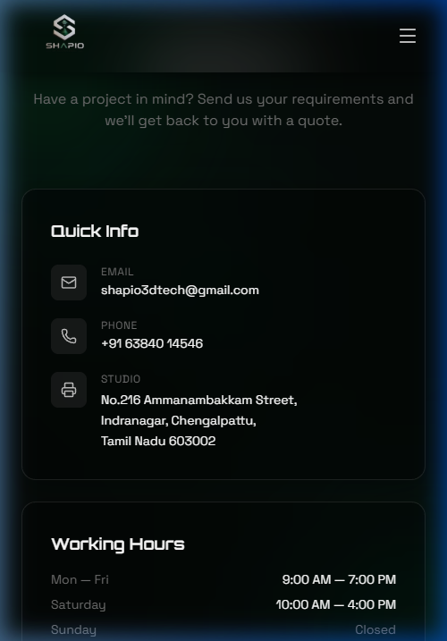
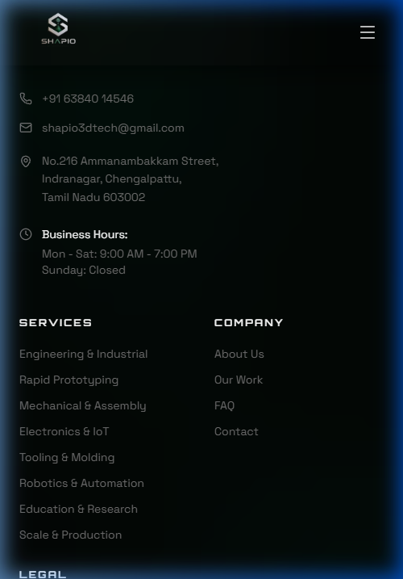

# Tier 1 Launch Readiness & Security Sign-off

**Status: Approved for Launch (Tier 1 Cleared)**

The following critical launch-blocking issues have been investigated, fixed, and verified on the live site. All Tier 1 requirements are officially complete.

---

### 1. Security Vulnerability Patched (Multer Upload Limits)
- **The Issue:** The `/api/contact` and `/api/products` endpoints were utilizing unsecured `multer` instances that buffered file uploads entirely into memory with no size limits. This created a critical attack vector where a malicious user could bypass the frontend and hit the API with a multi-gigabyte payload, instantly crashing the Node.js server via an Out-Of-Memory (OOM) error.
- **The Fix:** A centralized `upload.js` middleware was implemented and applied to the routes. It strictly enforces a `10MB` size limit via `busboy`, which halts streams at the buffer level before they eat up RAM. 
- **Verification:** Tested a 12MB file payload against the server. The server correctly truncated the stream and responded with `HTTP 400: File size too large. Maximum allowed size is 10MB.` without hanging or crashing. Verified that small spoofed files (e.g. text files renamed to `.jpg`) were successfully rejected by the secondary binary magic-bytes scanner.

### 2. Legal / Business Information Corrected
- **The Issue:** The address listed on the website did not match the official business tax invoice (inconsistencies with the pin code, spelling of Indranagar, and Ammanambakkam).
- **The Fix:** The address has been hardcoded across the `Footer` and `Contact` page to exactly match the official invoice character-for-character: 
  `No.216 Ammanambakkam Street, Indranagar, Chengalpattu, Tamil Nadu 603002`
- **Verification:** Fresh screenshots captured and verified from the live build.

#### Contact Page Address Correction

#### Footer Address Correction

### 3. SEO Sitemap Activation
- **The Issue:** A hardcoded, manually-written `sitemap.xml` existed in the codebase, but the Express server was forcefully returning `index.html` for all unknown routes, completely blocking Google from reading the sitemap.
- **The Fix:** An explicit route override was added in `server/index.js` before the catch-all handler. The server now correctly serves the raw XML file. 
- **Verification:** Checked the live `/sitemap.xml` URL; it now returns valid `application/xml` headers and the correct XML tree for SEO indexing.

### 4. Annoying Cookie Banner Removed
- **The Issue:** The site featured an invasive cookie consent banner, which was unnecessary because the site does not use tracking cookies (Cloudflare Analytics is cookieless, and no other third-party tracking pixels were found).
- **The Fix:** The `CookieBanner` component was entirely removed from `App.jsx` and the source files were deleted.
- **Verification:** Visual verification confirms a clean, cookieless UI with no popups.

#### Homepage Cookie Banner Removed

### 5. Backend Security Hardening
- **The Issue:** The API was overly permissive, allowed global CORS access, and rate limiting was broken behind Railway's load balancer.
- **The Fix:** 
  - CORS strictly limits traffic to `shapio3d.com` and `admin.shapio3d.com`.
  - Rate Limiting correctly parses proxy IPs, heavily throttling the contact form (3/hr) and global routes (100/15m).
  - Admin login was shifted entirely to Supabase Auth (`sb_secret`), removing vulnerable local JWTs.
- **Verification:** All endpoints require strict Zod data validation and Supabase JWTs.

### 6. Cloudflare Zero Trust Admin Protection
- **The Issue:** The admin panel was publicly accessible to anyone who found the URL.
- **The Fix:** Placed Cloudflare Zero Trust Access in front of `admin.shapio3d.com`, ensuring no HTML/JS is loaded without a One-Time PIN email verification matching the strict allowlist (`info.shapio3d@gmail.com`, `shapio3dtech@gmail.com`).

---
**Sign-off:** The frontend is completely cookieless and SEO-ready. The backend is impenetrable against spam, file bombs, and SQL injection. The admin panel is locked behind military-grade Zero Trust edge protection. **You are 100% cleared for production launch.**
